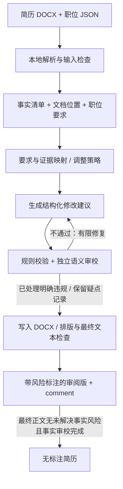

# Resume Studio 项目规划报告

日期：2026-09-07  
依据：当前项目目录、`.data` 中的 DOCX / JSON 样本，以及正文引用的官方技术文档。  
范围：产品与实现规划。首版本地应用已实现；实际交付范围与验证限制见下方记录及 [README.md](README.md)。本报告未包含三家真实模型的质量/费用对比。

**2026-09-07 实现记录：**用户已授权开始开发并要求支持 OpenAI、Gemini 和 Claude API，因此“是否允许云端 API”已确认。当前已实现三家原生接口、DOCX/JSON 解析、基于证据的段落改写、规则与全文语义审校、Word 高亮/批注、风险处理后重新审校、条件式无标注导出，以及 Streamlit 页面和命令行。后文阶段划分保留为设计基线；当前版本采用原位段落修改与违规回退，尚未实现自动段落重排、标准模板和自动压页。真实模型质量对比、费用测量及 Word/LibreOffice 实际分页验收仍待执行。

**2026-09-08 交互审阅扩展：**开发前已将原有版本保存为 Git 提交 `fa07ab8`，后续在 `feature/interactive-review` 分支开发。应用现增加按原文位置的结构预览、行内差异、段落选择与疑点定位、手动编辑及撤销、逐段 AI 对话和即时改写、草稿恢复。AI 续改仍复用三家原生 API，执行规则与独立段落审校；正式输出再执行全文审校。草稿独立保存在 `workspace.json`，原导出版本保持不变。浏览器预览负责交互与定位，不替代 Word 的分页与格式验收。后文为原规划基线，以 README 的当前使用方式为准。

建议先做一个单用户本地应用：上传原始简历和职位 JSON，一次生成可编辑的 Word 简历，以及能逐项解释修改依据的 AI comment。开发投入优先用于事实准确、职位针对性、文档可用性，最后再接一个简单页面。

## 1. 产品目标与边界

**核心目标：让已有经历更准确地回应目标职位，使用户能快速审阅并得到一份可投递的简历。**

“效果好”具体意味着：突出最相关的真实经历；保留有价值的成果和数字；表达清晰、减少泛泛的形容词；指出无法通过措辞解决的差距；生成文档没有信息丢失和明显排版问题。

第一版输入与输出：

| 项目 | 约定 |
| --- | --- |
| 简历输入 | 一份 `.docx`，作为本次改写的事实来源 |
| 职位输入 | 一份 `.json`，优先兼容现有五个样本的结构 |
| 必须输出 | `resume_review.docx`（含风险标注的审阅版）和 `comments.md`；满足事实审校条件后另提供 `tailored_resume.docx`（无标注版） |
| 辅助输出 | `changes.json`、`validation.json`、本次运行配置，便于核查和复现 |
| 简历语言 | 默认跟随输入，目前样本为英文 |
| Comment 语言 | 默认中文，原句和改写句保留英文，便于对照 |
| 排版策略 | 默认保留原简历的布局和层级；当前基础样本以两页为目标 |
| 原文件 | 保持原样，每次运行创建独立输出目录 |

“Comment”包含独立修改说明，以及审阅版 Word 中定位到具体句子的风险批注。**风险标注属于第一版必需功能**，页面、审阅版 DOCX 和说明文件均应能看到；不能要求用户打开另一份报告才知道某句话有疑问。无标注版仅在其中没有未解决的事实风险、事实审校已完成时提供；这不代表系统进行了外部背景核实，分页等其他验证状态仍单独显示。

**已确认的本地运行方式：**界面、解析、文档生成和文件存储在本机，支持用户要求的 OpenAI、Gemini 和 Claude 云端模型 API。必要的简历正文和职位内容会发送给所配置的模型服务，不能称为“数据全程不出本机”。完全离线适配保留为未来选项。

第一版暂不做账号、云同步、招聘网站抓取、自动投递、向量数据库、多代理系统、模型微调、复杂在线 Word 编辑器或大量模板。现有任务可以用有明确输入输出的固定流程完成。

## 2. 样本检查结果与设计影响

当前目录只有 `.data`，尚无应用代码、依赖配置或 Git 仓库。共有 **1 份基础简历、5 份职位 JSON、5 份定制简历、5 份改进报告**，另有 14 个 `:Zone.Identifier` 附属文件，应在输入扫描时忽略。

基础简历：[Ying_Men_Resume_Decision_Intelligence_AI_Product_Strategy_Two_Page.docx](.data/Ying_Men_Resume_Decision_Intelligence_AI_Product_Strategy_Two_Page.docx)。报告暂将它作为其他职位版本的共同事实基线；文件排列支持这种解释，但不证明其他版本中的新增经历一定不真实。

| 职位样本 | 应突出的现有证据 | 必须识别的差距或风险 |
| --- | --- | --- |
| [Baylor Genetics](.data/baylor_genetics_sr_mgr_corporate_strategy/baylor_genetics_sr_mgr_corporate_strategy.json) | 机会评估、组合优先级、跨职能执行、管理层建议 | 原简历未明确提供 OKR/KPI 治理、WorkBoard 等经验 |
| [Amgen](.data/amgen_strategic_planning_ops_sr_mgr/amgen_strategic_planning_ops_sr_mgr.json) | 高管支持、项目推进、团队协同、生命科学背景 | 不能推导出已经负责 AI/Data 部门、年度 offsite 或 Finance/HR 运营协调 |
| [Allergan Aesthetics](.data/allergan_senior_manager_strategy/allergan_senior_manager_strategy.json) | 投资决策支持、市场研究、商业影响、优先级框架 | 原简历缺少明确的 DCF/NPV、定价弹性、客户数据分析和 build-versus-buy 实操证据 |
| [Metis Strategy](.data/metis_strategy_manager_consultant/metis_strategy_manager_consultant.json) | 咨询团队管理、C-suite 客户沟通、研究中心、出版成果 | JD 要求位于太平洋时区；原简历地址在 NJ，不能用“愿意配合西海岸时间”自动判定满足 |
| [Rocket Travel / Agoda](.data/rocket_travel_agoda_commercial_strategy_sr_mgr/rocket_travel_agoda_commercial_strategy_sr_mgr.json) | 商业拓展、市场与竞争分析、客户收入、资源优先级 | 不能自动补入 SQL、Tableau、旅行行业经验；JSON 自带签证信号冲突和无关新闻提示 |

### 样本中值得直接转化为验收用例的问题

1. **解析不能只读正文段落。**基础 DOCX 有 49 个顶层段落和 6 个表格；公司、学校和部分日期在表格内。还有一个显式分页符及第二页续页标题。应按文档顺序读取段落与表格，并识别续页内容，避免丢失雇主或把同一家公司识别成两份工作。
2. **定制样本需要校审，不能直接当标准答案。**例如 Allergan 定制简历新增了 DCF、NPV、Tableau、Power BI 等原简历未明确记载的能力；Amgen 版本加入 OKR/KPI、offsite 和运营协调经验。它们可以提供表达参考，但新增事实必须另有证据。
3. **保留数字不等于保留事实。**基础简历的 `executive approval rates by 50%` 在部分定制版变成 `approval velocity by 50%`。审批通过率和审批速度是不同指标，校验必须覆盖数字的对象、单位、归属和因果强度。
4. **状态不能靠日期推断。**基础简历写证书 `in progress; expected Aug 2026`，当前已是 2026 年 9 月，应提示更新。Allergan 版本去掉了进行中状态；应用不能据此认定已经取得证书。
5. **JD 不是完全干净的数据。**`h1b_sponsorship` 同时出现布尔值和字符串，薪资可为 `null`；Rocket 样本有与公司无关的 Coinbase 新闻；某些 `required` 条目实际写着 “preferred”。应保留原文及冲突，不能只凭字段位置决定硬性要求。
6. **已有匹配分数不是效果证据。**`match_score` 来自外部平台，既不是本应用的评估结果，也不能用作候选人事实。现有报告中的“perfect match”等结论不应沿用。

以上检查基于 DOCX 的文本和 XML 结构；尚未通过 Word 或 LibreOffice 实际渲染，不能据文件名或报告自述断言这些文档实际都是两页。

## 3. 用户流程

1. 选择原始简历 DOCX 和职位 JSON。页面显示识别出的公司、职位与输入摘要，允许发现选错文件。
2. 点击“生成”。默认参数即可工作：保持简历语言、中文说明、保留原格式。页数目标作为次要设置。
3. 页面显示当前阶段：读取文件、分析职位、改写、检查事实、生成文档。
4. 完成后先展示“待核实 N 项、已拦截/回退 M 项”和文档状态，再展示总体建议、关键改动及下载。点击风险可查看对应句子、原文证据和处理建议。
5. 存在缺失技能时，不阻断其余内容生成；将该技能排除在无标注版之外，并说明原因。仍含疑似问题的文档标记“待核实”，提供带标注的审阅版，不能显示为“可直接投递”。

第一版提供最小风险处理闭环：恢复原文、删除问题表述，或补充事实后重新审校。用户补充真实的项目、工具、职责和成果时，单独留存内容并标明用户补充来源；核实证书状态等问题也须明确填写实际状态。单纯点击“接受这条改写”或“忽略提醒”不能使无依据声明自动通过审校。用户可以先下载审阅版，不必立即处理所有问题。

## 4. 核心生成流程



### 4.1 解析：同时保留语义和文档位置

DOCX 解析输出两类信息：一类是经历、教育、技能等语义内容，另一类是原始段落、单元格、样式和运行片段的位置。为每个文本块分配稳定 ID，绑定原文件哈希，后续修改按 ID 应用。

按阅读顺序遍历正文段落和表格，保留项目符号、链接、日期及分页信息；按需读取页眉页脚并区分重复装饰内容。将 `PROFESSIONAL EXPERIENCE (CONTINUED)` 归入同一逻辑章节。

对于文本框、复杂多栏、修订记录、图片中的简历正文或加密文档，先检测支持情况。无法完整解析时明确指出受影响的位置，不以缺失的文本继续生成完整简历。首版承诺覆盖当前基础样本及常见段落/表格简历，不承诺任意 Word 版式。

职位 JSON 归一化为 `JobSpec`：职位名称、公司、职责、资格、技能、工作地点及限制条件。保留 JSON 路径和原文；忽略与职位无关的新闻；外部匹配分数只作为源文件信息存档。

保留资格条件的 AND/OR 关系。例如 Amgen 的博士加 2 年、硕士加 4 年、本科加 6 年应识别为替代条件，不能要求同时满足。缺少可识别的职位要求时，返回清晰错误；未知附加字段不应导致整份 JSON 无法使用。

### 4.2 建立事实清单与职位要求映射

先从输入抽取候选人事实：雇主、正式职位、任职时间、教育、证书状态、技能、职责、成果及量化指标。每项事实保留原文位置。这里的“事实”表示输入提供的声明，不代表系统已进行外部背景核实。

为职位要求标记 `direct`（有直接证据）、`transferable`（存在可迁移经验）、`missing`（未找到证据）、`conflict`（信息冲突）。用可追溯的理由解释判断，不输出看似精确却未经校准的置信度百分比。

例如，跨职能推进 10+ 项目可以支持项目执行能力；它本身不能证明管理过 AI/Data 组织。MBA 学位也不能直接证明熟练使用 DCF 模型。

联系信息在本地锁定和回填，普通改写请求不必发送电话、邮箱或详细地址；只有判断地点条件所需的城市/地区参与分析。职位文件和简历里的指令性文字只当输入资料，不作为改变应用规则的命令。

### 4.3 制定调整策略与改写

模型先输出简短策略：目标职位最重要的 3–5 项要求、应强调的已有证据、应压缩的内容、无法弥补的差距。然后生成结构化改动。

允许修改 headline、summary、能力描述和经历 bullet；允许在同一段任职经历中重排 bullet，压缩重复内容。默认保持工作时间顺序、正式职位名称和雇主归属，不把其他公司的成果搬入当前职位。

每个改动至少包含 `target_block_id`、`operation`、`before`、`after`、`evidence_ids`、`requirement_ids` 和 `reason`。删除和重排也要记入改动记录。插入内容只能由已存在的证据支持。

生成参数以低随机性为初始设置，但不承诺多次调用文本完全一致。普通任务先采用“分析—改写—审校”三次主要模型调用；只在质量实验显示必要时增加步骤。

### 4.4 事实审校与有限修复

先运行确定性校验：输入锚点存在、原文匹配、结构合法、证据 ID 有效、公司/职位/日期/学历/证书状态没有越权变化，数字及其所属经历保持一致。

再用单独一次模型调用审校最终声明是否由证据支持。审校输入包含原始证据、JD 和候选简历，不仅查看改写模型的解释。模型审校能补充语义判断，但不能保证发现所有错误，因此必须与规则和人工抽检结合。

同一个模型可承担不同阶段，先不引入多代理框架。高风险改动最多进行两轮修复；仍不通过时恢复对应原文、记录原因，并重新检查全文连贯性。解析不完整、证据错配等全局错误应终止，不输出标为完成的简历。

特别保护以下含义：`supported` 不能无依据变成 `owned`；营收潜力不能变成已实现收入；通过率不能变成速度；`10+` 的范围不能缩窄；团队成果不能变成个人独立成果。对原简历中的 $5B/$10B 等大额数字可保留原有表述并建议核实归因，不能擅自加强或“纠正”。

### 4.5 明确问题与疑似问题都必须显式标注

用户已明确要求避免无依据新增和事实含义变化，并将生成结果中的问题或疑似问题标注出来。处理原则为：**生成前约束、生成后检查、发现问题后处理并展示；不能用一条笼统免责声明代替逐句标注。**

| 风险类别 | 例子 | 自动处理与用户呈现 |
| --- | --- | --- |
| 明确违规 | 无来源的 SQL/DCF 技能；审批通过率改为审批速度；进行中证书改为已取得 | 拦截该改动，修复、恢复原文或删除；在对应位置的批注和 comment 中列出被拦截表述、依据及处理结果，不让错误句作为有效正文保留 |
| 疑似问题 | “参与”改成“主导”的依据不充分；泛化研究被具体化为定价分析；收入因果归属含糊 | 默认尝试改为证据能支持的保守表达；仍无法判断的句子在审阅版中高亮并批注“待核实”，禁止其进入无标注版 |
| 原文自身待核实 | 证书预计完成日期已过；原文前后矛盾或指标定义含糊 | 标明“原文已有疑点”，说明核实原因；不能因为复制原文就自动认定风险已解决，也不应指认用户陈述不实 |

“未找到证据”只说明当前输入不足，不等同于“确认虚假”。允许用户补充真实经历，但职位描述、其他 AI 改写样本或模型常识都不能充当候选人事实证据。审校结论冲突时保留为待核实；审校失败或未执行时显示“事实检查未完成”，不输出“未发现问题”的成功状态。

每条风险记录至少包含：`risk_id`、类别、来源（模型改写/原文）、文本块与句子位置、被质疑原句、对应原始证据或“未找到依据”、具体原因、建议替代表述/核实问题、处理状态及最终文档位置。处理状态区分待核实、已修复、已回退、已删除、已补充事实并复核；保留处理历史。

审阅版使用**高亮 + 带编号的 Word 批注**定位仍存在的疑点，批注包含明确文字标签，不仅靠颜色区分。已回退的错误改动在恢复后的句子处留处理批注，不继续高亮成未解决风险；已删除且没有正文锚点的内容放在相关章节的审阅批注中。页面和 comment 使用相同编号及状态。

示例批注：`R-003｜指标含义变化｜已拦截并恢复原文：改写将 approval rates（通过率）变成 approval velocity（速度）。原文只支持通过率提高 50%。`

示例疑点：`R-004｜待核实｜原文已有疑点：证书标注 expected Aug 2026，该日期已过。请补充实际状态；系统没有将其改为已取得。`

每次压缩、用户编辑、风险处理和最终写入后，都应针对变更重新校验、更新锚点与风险清单。已被修复的问题必须显示为已处理，不能遗留在待核实数量中；没有解决的疑点不能因重排或导出丢失标注。无标注版应从复核通过的同一份内容生成，不能通过简单隐藏批注把待核实草稿变成最终版。

## 5. DOCX 输出：先保证原模板可用

**2026-09-08 更新：原位置修订对照。**新增 `resume_comparison.docx`，用 Word 原生插入/删除修订比较原简历与最终正文，按词显示改动，支持在 Word 中接受/拒绝。原位上下文与风险批注保留；已回退错误不进入正文修订。导出必须验证接受全部后的正文与最终输出一致、拒绝全部后的正文与原文一致。新运行自动生成，旧结果可本地补生成，无需再次调用 AI；现有风险审阅版与条件式无标注版继续保留。Word 中接受修订不会自动更新应用风险状态。

**首版默认复制原文档，按修改清单生成审阅版；无标注版只应用通过事实审校的最终内容。**审阅版保留未解决疑点的高亮与批注，明确违规按第 4.5 节处理。这与当前用户已有 Word 简历的输入方式最一致，也减少重新设计模板的工作。

采用 `python-docx` 操作文档，必要时针对已支持的结构处理 OOXML。官方提供按顺序遍历段落/表格的接口；文本块应继续递归处理单元格。[Document API](https://python-docx.readthedocs.io/en/latest/api/document.html)

不要对整份文档简单逐段赋值 `paragraph.text`：该操作会替换段落内容并去除 run 层级的格式。对于允许整体改写的 bullet，可以按原样式重建文本；对含链接、混合加粗或日期对齐的段落，应显式保留或重建相应结构。[Text API](https://python-docx.readthedocs.io/en/latest/api/text.html)

内容变长后的排版处理顺序：

1. 按原章节和页面设定文本预算；先压缩重复表达、减少低价值 bullet。
2. 保留合理字号和行距。标准模板若后续加入，可先以 10–11 pt 正文字号、0.6–0.75 英寸页边距试排；这些是设计初值，不是通用标准。
3. 用 LibreOffice 命令行转换为 PDF，检查实际页数和文本提取顺序；每次转换使用独立临时配置目录和超时。官方支持无界面运行及转换参数。[启动参数](https://help.libreoffice.org/latest/en-US/text/shared/guide/start_parameters.html)
4. 对当前基础样本以两页为目标。超页最多做一轮定向压缩并重新执行事实和渲染检查；仍超页则在结果中标记需审阅，不无限缩小字体。
5. 未安装渲染工具时仍可生成 DOCX，但明确标记“未验证分页”；缺字体导致替换也应可见。实际 Word 与 LibreOffice 分页可能存在差异，最终验收需人工打开 DOCX 查看。

重新读取输出 DOCX，核对最终文本与已批准修改一致，检查雇主、日期、学校、项目符号和链接没有丢失。PDF 文本检查可以发现部分阅读顺序问题，不能单独证明所有招聘系统都能正确解析。

原格式编辑若在样本验证中持续不稳定，再增加一个简单的单栏标准模板作为可选输出。不要在用户不知情时将复杂文档悄悄转换成完全不同的布局。

## 6. AI comment 应该交付什么

Comment 依据**最终实际写入文件的修改记录和风险记录**生成，经过修复、回退或压缩后同步更新，避免出现“报告说做了，简历却没有”的情况。开头列出未解决疑点及其位置，并区分“仍在审阅正文中”和“已拦截/回退”；即使明确问题已经自动修复，也应让用户知道发生过什么。

建议包含五部分，默认正文简短，逐条明细可展开：

| 部分 | 内容 |
| --- | --- |
| 定位建议 | 该职位最看重什么，本次如何突出已有优势 |
| 关键改动 | 原句、改写句、对应 JD 要求、原始证据和修改理由 |
| 差距与限制 | 区分缺少证据、信息冲突和明确不满足条件 |
| 待补充问题 | 只问能影响结果的具体事实，例如是否实际建立过 DCF 模型 |
| 质量结果 | 事实检查、回退内容、分页状态、仍需人工确认的项目 |

示例：

> 修改：把筛选 200+ 创新想法并识别 30+ 高潜力概念的经历放到该职位经历的前部，突出组合优先级判断。数字与成果阶段保持不变。
>
> 依据：原简历已明确说明筛选数量和识别结果；该 JD 重视机会评估和优先级排序。
>
> 未写入：DCF/NPV 建模。原简历没有明确证据；若确实做过，请补充项目、模型用途及个人职责。

Comment 不应把职位要求编成面试故事，不应承诺面试率或录用率。第一版不生成冗长公司介绍或面试指导；样本报告的逐项解释形式值得保留，夸大评价和未经证实的经历应去除。

## 7. 技术方案与项目结构

| 层 | 建议 | 选择理由 |
| --- | --- | --- |
| 核心流程 | Python，普通函数/模块组织 | 文档处理与生成逻辑集中，便于独立验证 |
| 简单页面 | Streamlit，仅监听本地地址 | 上传、生成、对照、下载足够完成闭环 |
| 数据约束 | Pydantic 定义输入、改动、审校结果 schema | 模型输出必须验证后才能进入下一阶段 |
| Word | python-docx，少量隔离的 OOXML 操作 | 对样本中的段落、表格和样式进行可控编辑 |
| 模型 | 单一适配器，配置 provider / model / endpoint | 便于比较效果，支持后续替换云端或本地服务 |
| 渲染检查 | LibreOffice + PDF 页数/文本检查工具 | 提供实际分页检查；人工验收补足视觉问题 |
| 存储 | 本地文件夹和 JSON | 单用户第一版无需数据库 |
| 验证 | pytest + 五职位样本评测脚本 | 验证事实、文档和效果变化 |

Streamlit 官方已提供文件上传和下载组件，适合此处的简单交互。[上传组件](https://docs.streamlit.io/develop/api-reference/widgets/st.file_uploader)、[下载组件](https://docs.streamlit.io/develop/api-reference/widgets/st.download_button)

原拟定结构如下；当前实际模块与运行方式见 README：

```text
resume-studio/
├── PLAN.md
├── app.py                       # 本地页面
├── pyproject.toml
├── src/resume_studio/
│   ├── pipeline.py              # 阶段编排、有限重试、保存结果
│   ├── schemas.py               # ResumeFacts / JobSpec / ChangeSet
│   ├── parsing.py               # DOCX 与职位 JSON
│   ├── tailoring.py             # 证据映射与改写
│   ├── validation.py            # 规则与语义审校
│   ├── rendering.py             # 修改 DOCX、检查输出
│   ├── reporting.py             # 最终 comment
│   └── llm.py                   # 模型适配器
├── prompts/                     # 分析、改写、审校提示词及版本
├── tests/                       # 解析、事实约束、导出与故障用例
├── evals/                       # 样本索引、人工标注、评测记录
├── .data/                       # 现有私人样本
└── outputs/<run_id>/             # 每次运行独立产物
```

单次运行保存输入哈希、模型标识、提示词和 schema 版本、阶段结果、耗时及 token 用量。涉及简历正文的调试记录仅本地按需保存；密钥由环境变量提供，避免写入代码或日志。未来建立 Git 仓库时忽略 `.data`、`outputs`、密钥和本地缓存。

超时或限流时有限重试，保留已完成的阶段；恢复运行时核对输入与配置哈希，防止使用过期结果。格式非法的模型响应经验证和有限修复后仍不合格则退出。输出先写临时目录，校验后再发布完整结果；失败不得覆盖上一份成功文件。页面重运行或重复点击不应自动重复计费调用。

## 8. 模型选择与完全离线方案

不在规划阶段凭榜单锁定具体模型。用同一批原始输入和评测标准比较两个候选模型，重点看：英文商业简历改写、结构化输出、证据约束执行、语义错误发现以及响应稳定性。

先使用一个质量优先的模型完成三个阶段。只有实测证明不降低关键指标，才将分析或审校阶段替换为便宜模型。首版无需微调，也不应将五份未校审的定制简历用于训练或作为事实知识库。

若用户要求完全离线，核心解析、schema、DOCX 输出和评价方法保持不变，模型适配器连接本机推理服务。落地前需了解操作系统、GPU/显存、内存和允许等待时间，并在最难样本上验证结构化输出与事实约束；不预先承诺普通笔记本能获得与云端候选模型相同的效果或速度。离线模式不应自动回退到云端。

暂定常规任务交互目标为 1–3 分钟完成，实际需以模型及渲染环境测量。单次成本按“输入 token × 输入单价 + 输出 token × 输出单价”，累加审校及重试计算；模型未选定前不写固定美元承诺。记录实际耗时与成本后再决定优化重点。

## 9. 如何证明“效果最重要”得到落实

### 建立小而可信的评价集

五个职位共用一份基础简历，适合作为首轮回归集，但不足以证明对其他候选人或复杂模板也有效。现有定制简历仅作为比较对象；先人工标注可用表达和无依据新增声明，不做逐字复现目标。

建议首轮用 Baylor、Allergan、Metis 调整流程，再将 Amgen、Rocket 用作本轮不参与提示词调优的验收运行。它们已经在规划中被查看，因此不能声称是完全盲测。后续增加至少两份不同结构的简历和新的 JD，检验泛化能力。

对比三种产物：原简历、简单“一次性改写”基线、本文的证据约束流程。人工比较时隐藏生成方式，评价职位针对性、事实保真、清晰度和文档可用性。

### 第一版验收标准

| 维度 | 验收要求 |
| --- | --- |
| 输入覆盖 | 五份 JSON 全部可归一化；基础 DOCX 的雇主、任职、学校和日期无遗漏 |
| 事实来源 | 每项新增/改写声明可追溯；人工复核未发现无依据新增技能、职责或成果 |
| 关键事实 | 公司、正式职位、日期、学历、证书状态，以及数字含义和归属零未授权变化 |
| 针对性 | 每个职位最重要且有证据的 3–5 项要求得到清晰表达；无证据的要求进入差距说明 |
| 可读性 | 人工按 1–5 分评估针对性与清晰度，目标均分至少 4 分；不能靠虚构换取分数 |
| 文档 | 在配置好字体和渲染工具的验收环境中，五个结果可打开且目标两页，无明显溢出、孤立标题和内容丢失 |
| Comment | 与最终 DOCX 的实际改动一致，解释依据、差距和未完成验证 |
| 风险识别与标注 | 人工标注/注入的明确违规与疑似问题在固定回归集中全部被定位，不能只在总评中笼统提醒；用合法同义改写作对照，检查误报 |
| 风险可见性 | 页面、审阅 DOCX、comment 的编号与状态一致；单独打开 Word 也能找到待核实句子及原因 |
| 风险处理与导出 | 明确违规已拦截或修复；无标注版不含未解决事实风险；恢复原文不得掩盖原文自身疑点；审校未完成不能导出为通过版本 |
| 标注同步 | 重排、压缩、删除和用户补充后锚点正确，已处理项不计入待核实；标注不改变正文事实或破坏链接/样式 |
| 稳定性 | 发布候选版本对五职位各跑三次，关键事实违规为零；措辞允许不同 |
| 故障处理 | 损坏 DOCX、缺关键字段、模型超时、非法 JSON、渲染缺失均有明确结果，不伪报成功 |

这些是发布门槛和目标，当前尚无实测结果。“零违规”指评测集中的观察结果，不代表模型在所有输入上绝不会出错。

不把关键词数量或外部 ATS 分数作为主指标。若显示匹配信息，优先用逐项要求和证据解释；没有证据的要求不能因为改写中出现同名关键词就被算作已满足。

特别需要固定的回归案例：审批率不能改成速度；进行中的证书不能变成已完成；不得新增 SQL/DCF/WorkBoard；Metis 地点限制不能忽略；Rocket 的赞助冲突和新闻噪声不能进入候选人事实；Amgen 资格的替代关系必须保留。

## 10. 开发顺序与工作量

以一名开发者、允许云端 API、先支持当前模板为前提，纳入逐句风险标注及处理闭环后，粗估 **8–13 个工作日**。这是规划估算；模型评测、字体和 Word 兼容问题可能延长时间。

| 阶段 | 粗估 | 交付与完成条件 |
| --- | --- | --- |
| 1. 样本基线与解析 | 1–2 天 | 事实清单、五职位归一化、样本问题标注；确认表格和续页信息没有丢失 |
| 2. 生成与事实审校 | 2–3 天 | 命令行跑通分析、改写、审校；先以 Allergan 验证无依据技能不会被写入 |
| 3. Word 与 comment | 3–4 天 | 原模板修改、逐句高亮/批注、重读与分页检查、风险状态同步及无标注版导出条件；跑通五职位 |
| 4. 本地页面与验收 | 2–4 天 | 上传、生成、对照、风险处理、下载、故障提示；比较两个模型并完成风险标注回归评测和使用说明 |

第一项具体开发任务应是：从基础 DOCX 完整抽取结构与事实，再针对 Allergan 输出一份保留真实证据的改写及修改说明。这个案例同时检验模型会不会盲目补技能、能否解释差距、Word 能否保持可用，比先做页面更能暴露核心问题。

如果原模板编辑的成本过高，应在第三阶段明确调整为可选标准模板；如果选定模型持续产生无依据声明，应回到第二阶段调整模型和约束。两种问题都不应靠继续完善界面来掩盖。

## 11. 开工前的默认决策

已确认支持 OpenAI、Gemini 和 Claude 云端 API。其余按下列默认值推进：简历跟随输入语言、comment 用中文、保留原版式、当前样本以两页为目标、先单职位运行、缺失事实进入建议且不自动补入正文。

最终优先级为：**事实与数字含义不失真、疑点可见 → 有依据的职位针对性 → Word 文件可用 → 说明可核查 → 速度和界面细节。**
